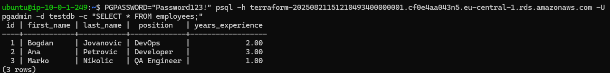
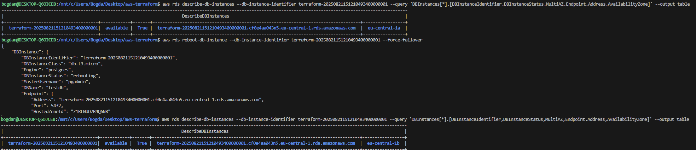

# 🚀 AWS-Terraform-Ec2-RDS Failover demo

The goal of this demo was to deploy a small AWS infrastructure using Terraform. I created a custom VPC with public subnets, an EC2 instance running Apache, and a Multi-AZ RDS PostgreSQL database. The idea was to demonstrate full IaC deployment, connectivity between EC2 and RDS, and RDS failover. 

This is the simple table that I created

This is the failover demonstration, switching between Mulity AZ

